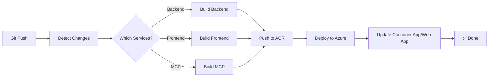

# CI/CD Pipeline Setup

Diese GitHub Actions Pipeline ermöglicht automatisches Build und Deployment für Backend, Frontend und MCP Server.

## 🔧 Voraussetzungen

### Azure Secrets in GitHub konfigurieren

Gehe zu **Settings** → **Secrets and variables** → **Actions** und füge folgende Secrets hinzu:

#### 1. AZURE_CREDENTIALS
Service Principal für Azure Login:
```bash
az ad sp create-for-rbac --name "github-actions-macae" \
  --role contributor \
  --scopes /subscriptions/{subscription-id}/resourceGroups/rg-karim \
  --sdk-auth
```

Das Ergebnis als JSON-Secret speichern:
```json
{
  "clientId": "xxx",
  "clientSecret": "xxx",
  "subscriptionId": "xxx",
  "tenantId": "xxx",
  "activeDirectoryEndpointUrl": "https://login.microsoftonline.com",
  "resourceManagerEndpointUrl": "https://management.azure.com/",
  "activeDirectoryGraphResourceId": "https://graph.windows.net/",
  "sqlManagementEndpointUrl": "https://management.core.windows.net:8443/",
  "galleryEndpointUrl": "https://gallery.azure.com/",
  "managementEndpointUrl": "https://management.core.windows.net/"
}
```

#### 2. ACR Credentials (Optional - wenn nicht Managed Identity)
Falls ACR Authentifizierung nötig:
```bash
# ACR Admin-User aktivieren
az acr update --name crdevpikfl --admin-enabled true

# Credentials abrufen
az acr credential show --name crdevpikfl
```

Secrets erstellen:
- **ACR_USERNAME**: crdevpikfl
- **ACR_PASSWORD**: (Password vom obigen Befehl)

## 🚀 Pipeline Features

### Automatische Change Detection
Die Pipeline erkennt automatisch welche Services geändert wurden:
- ✅ **Backend**: Bei Änderungen in `src/backend/**`
- ✅ **Frontend**: Bei Änderungen in `src/frontend/**`
- ✅ **MCP Server**: Bei Änderungen in `src/mcp_server/**`

Nur geänderte Services werden gebaut und deployed!

### Manuelle Trigger
Du kannst die Pipeline auch manuell starten:

1. Gehe zu **Actions** → **CI/CD - Build and Deploy Services**
2. Klicke auf **Run workflow**
3. Wähle welche Services deployed werden sollen:
   - ☑️ Deploy Backend
   - ☑️ Deploy Frontend
   - ☑️ Deploy MCP Server

### Versionierung
Jeder Build erhält automatisch eine Version:
- **Image Tag**: `v{run_number}` (z.B. v27, v28, v29)
- **Latest Tag**: Zusätzlich wird immer `latest` getaggt

## 📦 Deployment Flow



## 🔄 Beispiel Workflows

### Scenario 1: Backend Änderung
```bash
git add src/backend/v3/callbacks/response_handlers.py
git commit -m "Add citations to response handler"
git push
```
→ Nur Backend wird gebaut und deployed

### Scenario 2: Frontend + Backend Änderung
```bash
git add src/backend/v3/models/messages.py
git add src/frontend/src/models/agentMessage.tsx
git commit -m "Add Citation models to backend and frontend"
git push
```
→ Backend UND Frontend werden gebaut und deployed

### Scenario 3: Alle Services manuell deployen
1. Gehe zu **Actions**
2. Wähle **CI/CD - Build and Deploy Services**
3. **Run workflow** mit allen Checkboxen aktiviert

## 📊 Build Status

Nach jedem Deployment siehst du eine Summary:

```
🚀 Deployment Summary

Build Number: 27
Commit: 94db662

✅ Backend: Deployed successfully (v27)
⏭️ MCP Server: No changes detected
✅ Frontend: Deployed successfully (v27)

URLs:
- Backend: https://ca-devpikfl.gentleocean-9b2e934f.northeurope.azurecontainerapps.io
- Frontend: https://app-devpikfl.azurewebsites.net
- MCP: https://ca-mcp-devpikfl.gentleocean-9b2e934f.northeurope.azurecontainerapps.io
```

## 🔍 Monitoring

### Logs ansehen
```bash
# Backend Container App Logs
az containerapp logs show \
  --name ca-devpikfl \
  --resource-group rg-karim \
  --follow

# MCP Container App Logs
az containerapp logs show \
  --name ca-mcp-devpikfl \
  --resource-group rg-karim \
  --follow

# Frontend Web App Logs
az webapp log tail \
  --name app-devpikfl \
  --resource-group rg-karim
```

### Revision Status prüfen
```bash
# Backend Revisions
az containerapp revision list \
  --name ca-devpikfl \
  --resource-group rg-karim \
  --output table

# Aktuelle Backend Version
az containerapp show \
  --name ca-devpikfl \
  --resource-group rg-karim \
  --query "properties.latestRevisionName"
```

## ⚠️ Troubleshooting

### Pipeline schlägt fehl: "Authentication failed"
→ Service Principal Rechte prüfen:
```bash
az role assignment list --assignee {clientId} --output table
```

### ACR Push schlägt fehl
→ ACR Admin-User aktivieren oder Managed Identity konfigurieren

### Container startet nicht
→ Logs prüfen:
```bash
az containerapp logs show --name ca-devpikfl --resource-group rg-karim
```

### Frontend zeigt alte Version
→ Web App Cache leeren:
```bash
az webapp restart --name app-devpikfl --resource-group rg-karim
```

## 🎯 Best Practices

1. **Kleine Commits**: Committe Frontend und Backend separat wenn möglich
2. **Feature Branches**: Nutze Feature Branches für größere Änderungen
3. **Manual Trigger**: Teste große Änderungen erst manuell
4. **Monitor Logs**: Schaue nach Deployment immer in die Logs
5. **Rollback**: Bei Problemen kannst du zu einer älteren Image-Version zurück:
   ```bash
   az containerapp update \
     --name ca-devpikfl \
     --resource-group rg-karim \
     --image crdevpikfl.azurecr.io/backend:v25
   ```

## 📝 Nächste Schritte

- [ ] Secrets in GitHub konfigurieren
- [ ] Pipeline manuell testen
- [ ] Ersten automatischen Push durchführen
- [ ] Deployment verifizieren
- [ ] URLs testen
